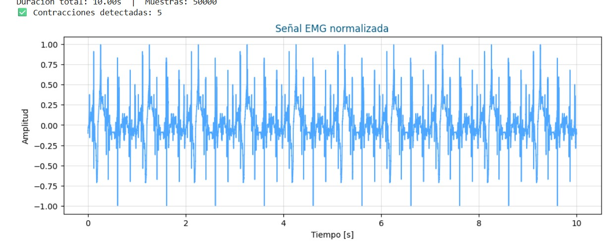

# Señal Electromiográfica EMG
## DESCRIPCIÓN 
En este repositorio analizaremos la practica desarollada que se titula **"Señales Electromiograficas"**, se realizo la captura y análisis de señales emuladas y reales, aplicando filtrado, segmentación, análisis espectral (FFT).Ademas se calcularon las frecuencias media y mediana de las contracciones musculares para observar cómo varían durante el esfuerzo para detectar la aparición de la fatiga.
## OBJETIVOS
-Aplicar el filtrado de señales continuas para procesar una señal electromiográfica(EMG).<br>
-Detectar la aparición de fatiga muscular mediante el análisis espectral de contracciones musculares individuales.<br>
-Comparar el comportamiento de una señal emulada y una señal real en términos de frecuencia media y mediana.<br>
-Emplear herramientas computacionales para el procesamiento, segmentación y análisis de señales biomédicas.<br>
# PROCEDIMIENTO
## PARTE A Captura de la señal emulada 
En esta primera parte del laboratorio se genero una señal EMG por medio del generador de señales el cual simuló cinco contracciones musculares voluntarias, representando la actividad eléctrica del músculo durante el esfuerzo,con una frecuencia de muestreo 5000 Hz y una duracion de 10 s. Los datos que se obtuvieron se almacenaron en un archivo de texto (Señal EMG5000.txt), para luego segmentarla por contraccion y calcular la frecuencia media y mediana de cada una, asi se puede observar cómo varía el contenido espectral a lo largo del tiempo.
Esta señal tuvo un analisis por energia,ya que la señal original es altamente ruidosa y oscilatoria, entonces el código calcula la energía local, que es la potencia promedio de la señal en una ventana de tiempo,asi los valores negativos desaparecen, ya que se elevan al cuadrado,las zonas con mayor actividad muscular (mayor amplitud EMG) se reflejan como picos de energía y se pueden detectar fácilmente las contracciones.<br>


 <br>

### CODIGO

```
import numpy as np
import matplotlib.pyplot as plt
from scipy.signal import find_peaks
from scipy.fft import fft, fftfreq
import pandas as pd
from google.colab import drive
drive.mount('/content/drive', force_remount=True)

```

En esta parte del codigo se importan las librerias necesarias para el analisis, como: scipy.signal para la deteccion de los picos y scipy.fft para la transformada rápida de Fourier (FFT), ademas se agrega Google Drive para acceder al archivo con la señal (Señal EMG5000.txt).

```

ruta = '/content/drive/MyDrive/Señal EMG5000.txt'
fs = 5000  # Frecuencia de muestreo [Hz]

emg = np.loadtxt(ruta)
T = 1/fs
t = np.arange(0, len(emg)*T, T)
print(f"Duración total: {t[-1]:.2f}s  |  Muestras: {len(emg)}")

```
En este segmento del codigo se define la frecuencia de muestreo, se carga la señal EMG desde el archivo que subimos,se calcula el vector de tiempo t para graficar la señal en el eje temporal y se muestra la duración total y número de muestras.

```
emg = emg - np.mean(emg)
if np.max(np.abs(emg)) != 0:
    emg = emg / np.max(np.abs(emg))

```

Este segmento es la normalizacion, se centra la señal en cero eliminando el offset y se divide por el valor máximo absoluto para que quede normalizada entre -1 y 1.

```
ventana = int(0.1 * fs)  # 100 ms
energia = np.convolve(emg**2, np.ones(ventana)/ventana, mode='same')
```
Este segmento es el calculo de energia local:Se calcula la energía promedio de la señal dentro de una ventana móvil de 100 ms para suavizar la señal y resaltar los periodos de contraccion.

```
peaks, _ = find_peaks(energia, distance=fs*0.8)
if len(peaks) > 5:
    peaks = peaks[:5]

anchura = int(0.5 * fs)
zonas_validas = [(max(0, p - anchura//2), min(len(emg), p + anchura//2)) for p in peaks]
print(f" Contracciones detectadas: {len(zonas_validas)}")
```

Esta parte del codigo hace la deteccion de contraccion de manera automatica, utilizando find_peaks() para detectar picos de energía, que corresponden a contracciones con un tiempo de 0,8s entre cada contraccion, se toman las primeras cinco contracciones y se crea un intervalo con estas cinco contracciones.


```
# --- (1) Señal original ---
plt.figure(figsize=(12,4))
plt.plot(t, emg, color='#4da6ff', linewidth=1.2)
plt.title('Señal EMG normalizada', color='#035a84')
plt.xlabel('Tiempo [s]')
plt.ylabel('Amplitud')
plt.grid(True, alpha=0.4)
plt.show()

# --- (2) Energía local ---
plt.figure(figsize=(12,4))
plt.plot(t, energia, color='#7ec8e3', label='Energía local')
plt.title('Energía local de la señal EMG (potencia por ventana)', color='#035a84')
plt.xlabel('Tiempo [s]')
plt.ylabel('Energía')
plt.legend()
plt.grid(True, alpha=0.4)
plt.show()

# --- (3) Segmentación automática ---
plt.figure(figsize=(12,4))
plt.plot(t, emg, color='#4da6ff', label='Señal EMG', linewidth=1.2)
for i, (ini, fin) in enumerate(zonas_validas):
    plt.axvspan(t[ini], t[fin], color='#b3e0ff', alpha=0.6, label='Contracción' if i==0 else "")
plt.title('Segmentación automática de contracciones (por energía)', color='#035a84')
plt.xlabel('Tiempo [s]')
plt.ylabel('Amplitud')
plt.legend()
plt.grid(True, alpha=0.4)
plt.show()

```

En este segmento del codigo se graficaron tres señales: la origina que muestra la señal EMG normalizada, energia local que muestra cómo varía la potencia de la señal y segmentacion automatica indicando las sombras azules que muestran las zonas de contracción detectadas.


```
def mean_median_freq(signal, fs):
    N = len(signal)
    freqs = fftfreq(N, 1/fs)[:N//2]
    fft_vals = np.abs(fft(signal))[:N//2]
    P = fft_vals**2
    if np.sum(P) == 0:
        return 0, 0
    f_mean = np.sum(freqs * P) / np.sum(P)
    cumulative_power = np.cumsum(P)
    f_median = freqs[np.where(cumulative_power >= cumulative_power[-1]/2)[0][0]]
    return f_mean, f_median

# Calcular frecuencias para las contracciones detectadas
resultados = []
for i, (ini, fin) in enumerate(zonas_validas[:5], 1):
    contr = emg[ini:fin]
    f_mean, f_median = mean_median_freq(contr, fs)
    resultados.append([i, f_mean, f_median])

if len(resultados) > 0:
    tabla = pd.DataFrame(resultados, columns=['Contracción','Frecuencia media (Hz)','Frecuencia mediana (Hz)'])
    print("\nResultados de frecuencia por contracción:")
    display(tabla)

    # --- (4) Evolución de frecuencias ---
    plt.figure(figsize=(8,5))
    plt.plot(tabla['Contracción'], tabla['Frecuencia media (Hz)'], 'o-', color='#7ec8e3', label='Frecuencia media', linewidth=2)
    plt.plot(tabla['Contracción'], tabla['Frecuencia mediana (Hz)'], 's--', color='#035a84', label='Frecuencia mediana', linewidth=2)
    plt.title('Evolución de las frecuencias EMG por contracción', fontsize=13, color='#035a84')
    plt.xlabel('Contracción')
    plt.ylabel('Frecuencia [Hz]')
    plt.legend()
    plt.grid(True, alpha=0.4)
    plt.show()
```
Esta parte  del código aplica la Transformada Rápida de Fourier (FFT) a cada contracción de la señal EMG para obtener su espectro de frecuencias.
A partir de ese espectro se calcula la frecuencia media, que representa el promedio ponderado del contenido en frecuencia, y la frecuencia mediana, que divide la energía espectral en dos mitades iguales.
Estas frecuencias permiten analizar cómo cambia el contenido de alta frecuencia durante el esfuerzo muscular: una disminución progresiva de estos valores indica la aparición de fatiga.
Finalmente, los resultados se presentan en una tabla y una gráfica que muestran la evolución de ambas frecuencias en cada contracción.


```
    contr1 = emg[zonas_validas[0][0]:zonas_validas[0][1]]
    N = len(contr1)
    freqs = fftfreq(N, 1/fs)[:N//2]
    fft_vals = np.abs(fft(contr1))[:N//2]
    P = fft_vals**2

    f_mean, f_median = mean_median_freq(contr1, fs)

    plt.figure(figsize=(8,5))
    plt.plot(freqs, P, color='#4da6ff', linewidth=1.2)
    plt.axvline(f_mean, color='#7ec8e3', linestyle='--', label=f'F media = {f_mean:.1f} Hz')
    plt.axvline(f_median, color='#035a84', linestyle='--', label=f'F mediana = {f_median:.1f} Hz')
    plt.title('Espectro de frecuencia (FFT) de una contracción', color='#035a84')
    plt.xlabel('Frecuencia [Hz]')
    plt.ylabel('Potencia (a.u.)')
    plt.legend()
    plt.grid(True, alpha=0.4)
    plt.show()

else:
    print("No se pudo calcular frecuencias porque no hay contracciones detectadas.")

```

La ultima parte del codigo selecciona la primera contracción detectada en la señal EMG (contr1) y se aplica la Transformada Rápida de Fourier (FFT) para obtener su espectro de amplitud.
La variable P representa la potencia espectral (energía contenida en cada frecuencia), que permite identificar qué rangos de frecuencia dominan la actividad muscular.Luego, el código calcula nuevamente la frecuencia media y la frecuencia mediana, y las muestra como líneas verticales sobre la gráfica:
La frecuencia media y La frecuencia mediana
Si no se detectan contracciones, el programa muestra un aviso para evitar errores en el cálculo.

### DIAGRAMAS

 <br>

En la grafica se observa la señal EMG normalizada en amplitud,los valores del eje Y van de -1 a 1, ya que la señal fue escalada (dividida por su valor máximo) para que todos los datos queden dentro de ese rango,La amplitud indica la intensidad de la actividad eléctrica generada por las fibras musculares.

 <br>

En la grafica se observa la energía local de la señal EMG,esta gráfica representa la energía promedio de la señal EMG a lo largo del tiempo, calculada usando una ventana deslizante de 100 ms.
La energía local refleja cuánta actividad eléctrica muscular hay en cada instante del registro,el cálculo de la energía local transforma una señal oscilatoria y ruidosa en una envolvente positiva y estable, donde los máximos de energía representan contracciones y los mínimos representan descanso o inactividad.

 <br>

En la grafica se observa la detección y segmentación automática de las contracciones musculares a partir de la energía local calculada anteriormente,el objetivo es mostrar en qué momentos del tiempo el algoritmo detectó actividad muscular significativa, subrayada por una franja azul claro.

 <br>

La tabla presenta los valores espectrales obtenidos tras aplicar la Transformada Rápida de Fourier (FFT) a cada contracción individual,las frecuencias medias se mantienen alrededor de 40 Hz, lo cual es consistente con una señal EMG emulada estable,La frecuencia mediana también permanece casi constante (≈6 Hz), indicando que el contenido de energía en frecuencia no varía significativamente entre contracciones lo cual indica que esta simulación esta sin presencia de fatiga muscular real.

 <br>

La gráfica compara los valores de frecuencia media y frecuencia mediana obtenidos para cada contracción de la señal EMG.Cada punto representa una contracción, y las líneas muestran la tendencia de ambos parámetros espectrales a medida que avanza el tiempo o el esfuerzo muscular,Esta gráfica demuestra que la señal EMG emulada presenta comportamiento estable entre contracciones, reflejando un músculo sin fatiga,tal como se espera en una señal generada artificialmente.

 <br>

Esta gráfica presenta el espectro de frecuencias de una sola contracción muscular obtenida de la señal EMG.
La FFT transforma la señal del dominio del tiempo (amplitud vs. tiempo) al dominio de la frecuencia (potencia vs. frecuencia), permitiendo analizar qué frecuencias predominan en la actividad muscular,el espectro tiene un pico pronunciado en bajas frecuencias, lo que indica que la mayor parte de la energía del músculo se concentra en componentes lentas,la energía disminuye rápidamente a medida que aumenta la frecuencia, lo que es típico en señales EMG, ya que las contracciones musculares contienen más información en bajas frecuencias.

# PARTE B- Procesamiento y análisis de señal EMG real
Codigo= https://colab.research.google.com/drive/1KPXxuYNoCQRyBh8D7oJwheDpsMR-HgaG#scrollTo=IOVJGvtOuy2u 
## Procedimiento
En esta segunda parte del laboratorio se trabajo el procesamiento de una señal electromiográfica (EMG) real, registrada sobre un grupo muscular durante la ejecución de contracciones voluntarias en este caso lo trabajamos especificamente en el antebrazo. Buscando analizar la actividad eléctrica de este y observando el comportamiento del espectro de frecuencias durante el esfuerzo y la posible aparición de fatiga muscular.<br>
<br>

Para ello, se aplicó un filtro pasa banda de 20–450 Hz que permitió eliminar artefactos de movimiento y ruido eléctrico, conservando solo las frecuencias fisiológicamente relevantes de la señal EMG. Posteriormente, la señal se segmentó en contracciones individuales, se calculó para cada una la frecuencia media y mediana mediante la Transformada de Fourier, y se graficaron los resultados para evaluar la tendencia del espectro.<br>

Este análisis permite relacionar los cambios en el contenido frecuencial con los procesos fisiológicos de la fatiga, ya que una disminución progresiva de las frecuencias indica una menor velocidad de conducción de las fibras musculares y una reducción de la frecuencia de activación de las unidades motoras.<br>

## Diagrama
<br>

## Codigo 
```
import numpy as np
import pandas as pd
import matplotlib.pyplot as plt
from scipy.signal import butter, filtfilt, find_peaks
from scipy.fft import fft, fftfreq
from google.colab import files

# === a–b. CARGAR SEÑAL EMG REAL ===
print("archivo de señal EMG (CSV)")
uploaded = files.upload()

# === CONFIGURACIÓN ===
archivo = list(uploaded.keys())[0]
fs = 2000  # Frecuencia de muestreo (Hz) 

# === c. FILTRADO PASA BANDA 20–450 Hz ===
def bandpass_filter(sig, fs, lowcut=20, highcut=450):
    nyq = 0.5 * fs
    b, a = butter(4, [lowcut/nyq, highcut/nyq], btype='band')
    return filtfilt(b, a, sig)

# Lectura
data = pd.read_csv(archivo, header=None, sep=None, engine='python')
data = data.apply(pd.to_numeric, errors='coerce').dropna()
signal = data.iloc[:,0].values.astype(float)
filtered = bandpass_filter(signal, fs)
```
Este bloque del código carga y prepara la señal EMG para su análisis. Permite subir el archivo CSV, define la frecuencia de muestreo (2000 Hz) y aplica un filtro pasa banda Butterworth (20–450 Hz) que elimina el ruido y conserva la información útil del músculo, dejando la señal lista para analizar las contracciones y sus frecuencias.<br>

```
# === Visualización señal original y filtrada ===
t = np.arange(len(signal)) / fs
plt.figure(figsize=(12,5))
plt.subplot(2,1,1)
plt.plot(t, signal)
plt.title("Señal EMG original")
plt.xlabel("Tiempo (s)")
plt.ylabel("Amplitud")

plt.subplot(2,1,2)
plt.plot(t, filtered, color='orange')
plt.title("Señal EMG filtrada (20–450 Hz)")
plt.xlabel("Tiempo (s)")
plt.ylabel("Amplitud")
plt.tight_layout()
plt.show()

# === d. DETECCIÓN AUTOMÁTICA DE CONTRACCIONES ===
# Basada en energía RMS normalizada
window = int(0.2 * fs)
rms = np.sqrt(np.convolve(filtered**2, np.ones(window)/window, mode='same'))
rms_norm = (rms - np.min(rms)) / (np.max(rms) - np.min(rms))
peaks, _ = find_peaks(rms_norm, height=np.mean(rms_norm)*1.1, distance=int(fs*0.3))

# Construir intervalos en segundos
intervalos = []
dur = 0.6  # Duración aproximada (s)
for p in peaks:
    start = max((p/fs) - dur/2, 0)
    end = min((p/fs) + dur/2, len(filtered)/fs)
    intervalos.append([start, end])

# Si no detecta, toma toda la señal como una contracción
if len(intervalos) == 0:
    intervalos = [[0, len(filtered)/fs]]

print(f" Contracciones detectadas: {len(intervalos)}")

# Visualizar energía y detección
plt.figure(figsize=(12,4))
plt.plot(t, rms_norm, label='RMS normalizada')
plt.plot(np.array(peaks)/fs, rms_norm[peaks], 'ro', label='Contracciones detectadas')
plt.title("Detección automática de contracciones (energía RMS)")
plt.xlabel("Tiempo (s)")
plt.ylabel("Energía normalizada")
plt.legend()
plt.grid(True)
plt.show()

```
Este bloque del código visualiza la señal EMG original y filtrada, permitiendo comparar el registro sin procesar con la versión limpia. Luego calcula la energía RMS (Root Mean Square) para estimar los periodos de mayor actividad muscular y, a partir de esa energía normalizada, realiza la detección automática de contracciones utilizando el método de picos. Cada contracción identificada se guarda con su intervalo de inicio y fin en segundos. Finalmente, se muestra una gráfica de energía RMS donde los picos rojos representan las contracciones detectadas en la señal.<br>

```

import numpy as np
import pandas as pd
import matplotlib.pyplot as plt
from scipy.signal import butter, filtfilt, find_peaks
from scipy.fft import fft, fftfreq
from google.colab import files

# === a–b. CARGAR SEÑAL EMG REAL ===
print("archivo de señal EMG (CSV)")
uploaded = files.upload()

# === CONFIGURACIÓN ===
archivo = list(uploaded.keys())[0]
fs = 2000  # Frecuencia de muestreo (Hz) 

# === c. FILTRADO PASA BANDA 20–450 Hz ===
def bandpass_filter(sig, fs, lowcut=20, highcut=450):
    nyq = 0.5 * fs
    b, a = butter(4, [lowcut/nyq, highcut/nyq], btype='band')
    return filtfilt(b, a, sig)

# Lectura
data = pd.read_csv(archivo, header=None, sep=None, engine='python')
data = data.apply(pd.to_numeric, errors='coerce').dropna()
signal = data.iloc[:,0].values.astype(float)
filtered = bandpass_filter(signal, fs)

# === Visualización señal original y filtrada ===
t = np.arange(len(signal)) / fs
plt.figure(figsize=(12,5))
plt.subplot(2,1,1)
plt.plot(t, signal)
plt.title("Señal EMG original")
plt.xlabel("Tiempo (s)")
plt.ylabel("Amplitud")

plt.subplot(2,1,2)
plt.plot(t, filtered, color='orange')
plt.title("Señal EMG filtrada (20–450 Hz)")
plt.xlabel("Tiempo (s)")
plt.ylabel("Amplitud")
plt.tight_layout()
plt.show()

# === d. DETECCIÓN AUTOMÁTICA DE CONTRACCIONES ===
# Basada en energía RMS normalizada
window = int(0.2 * fs)
rms = np.sqrt(np.convolve(filtered**2, np.ones(window)/window, mode='same'))
rms_norm = (rms - np.min(rms)) / (np.max(rms) - np.min(rms))
peaks, _ = find_peaks(rms_norm, height=np.mean(rms_norm)*1.1, distance=int(fs*0.3))

# Construir intervalos en segundos
intervalos = []
dur = 0.6  # Duración aproximada (s)
for p in peaks:
    start = max((p/fs) - dur/2, 0)
    end = min((p/fs) + dur/2, len(filtered)/fs)
    intervalos.append([start, end])

# Si no detecta, toma toda la señal como una contracción
if len(intervalos) == 0:
    intervalos = [[0, len(filtered)/fs]]

print(f" Contracciones detectadas: {len(intervalos)}")

# Visualizar energía y detección
plt.figure(figsize=(12,4))
plt.plot(t, rms_norm, label='RMS normalizada')
plt.plot(np.array(peaks)/fs, rms_norm[peaks], 'ro', label='Contracciones detectadas')
plt.title("Detección automática de contracciones (energía RMS)")
plt.xlabel("Tiempo (s)")
plt.ylabel("Energía normalizada")
plt.legend()
plt.grid(True)
plt.show()

# === e. CÁLCULO DE FRECUENCIAS ===
def mean_median_freq(segment, fs):
    N = len(segment)
    fft_vals = np.abs(fft(segment))
    freqs = fftfreq(N, 1/fs)
    mask = freqs > 0
    freqs = freqs[mask]
    psd = fft_vals[mask]**2
    mean_f = np.sum(freqs * psd) / np.sum(psd)
    cum = np.cumsum(psd)
    median_f = freqs[np.where(cum >= cum[-1]/2)[0][0]]
    return mean_f, median_f, freqs, psd

segments = []
for inicio, fin in intervalos:
    start = int(inicio * fs)
    end = int(fin * fs)
    segments.append(filtered[start:end])

mean_freqs, median_freqs = [], []

plt.figure(figsize=(10,5))
for i, seg in enumerate(segments, start=1):
    mean_f, median_f, freqs, psd = mean_median_freq(seg, fs)
    mean_freqs.append(mean_f)
    median_freqs.append(median_f)
    plt.plot(freqs, psd, label=f'Contracción {i}')
    plt.axvline(mean_f, color='r', linestyle='--')
    plt.axvline(median_f, color='g', linestyle=':')
plt.title("Transformada de Fourier - Señal EMG")
plt.xlabel("Frecuencia (Hz)")
plt.ylabel("Potencia (PSD)")
plt.legend()
plt.grid(True)
plt.show()

# === f. TABLA Y GRÁFICA DE RESULTADOS ===
results = pd.DataFrame({
    "Contracción": np.arange(1, len(mean_freqs)+1),
    "Frecuencia Media (Hz)": np.round(mean_freqs, 2),
    "Frecuencia Mediana (Hz)": np.round(median_freqs, 2)
})
print("\n--- RESULTADOS ---")
print(results.to_string(index=False))

# Gráfica evolución si hay más de una
if len(segments) > 1:
    plt.figure(figsize=(8,4))
    plt.plot(results["Contracción"], results["Frecuencia Media (Hz)"], 'o-', label="Frecuencia media")
    plt.plot(results["Contracción"], results["Frecuencia Mediana (Hz)"], 'o-', label="Frecuencia mediana")
    plt.xlabel("Número de contracción")
    plt.ylabel("Frecuencia (Hz)")
    plt.title("Evolución de frecuencia media y mediana")
    plt.legend()
    plt.grid(True)
    plt.show()

# === g. ANÁLISIS AUTOMÁTICO DE FATIGA ===
if len(mean_freqs) > 1:
    tendencia = "disminuyen" if mean_freqs[-1] < mean_freqs[0] else "aumentan"
    print(f"\n Las frecuencias {tendencia} a medida que avanzan las contracciones,")
    print("lo cual es coherente con la aparición progresiva de fatiga muscular.")
else:
    print("\n Solo se detectó una contracción; no se puede evaluar la tendencia,")
    print("pero sí se calcularon sus frecuencias características (media y mediana).")

```

Este bloque de código realiza todo el procesamiento, análisis y visualización de la señal EMG real, cumpliendo con los pasos de la parte B del laboratorio. Primero, carga la señal desde un archivo CSV y aplica un filtro pasa banda Butterworth (20–450 Hz) para eliminar el ruido, mostrando la señal original y filtrada. Luego, calcula la energía RMS para identificar automáticamente los periodos de contracción muscular, marcándolos en una gráfica. Posteriormente, divide la señal en contracciones, y para cada una obtiene la Transformada de Fourier, a partir de la cual calcula la frecuencia media y mediana, que representan la distribución espectral del esfuerzo muscular. Finalmente, el código muestra una tabla con los valores obtenidos, grafica la evolución de las frecuencias (si hay varias contracciones) y analiza si existe una disminución de las frecuencias que indique la presencia de fatiga muscular.<br>

```
# === f. TABLA Y GRÁFICA DE RESULTADOS ===
results = pd.DataFrame({
    "Contracción": np.arange(1, len(mean_freqs)+1),
    "Frecuencia Media (Hz)": np.round(mean_freqs, 2),
    "Frecuencia Mediana (Hz)": np.round(median_freqs, 2)
})
print("\n--- RESULTADOS ---")
print(results.to_string(index=False))

# Gráfica evolución si hay más de una
if len(segments) > 1:
    plt.figure(figsize=(8,4))
    plt.plot(results["Contracción"], results["Frecuencia Media (Hz)"], 'o-', label="Frecuencia media")
    plt.plot(results["Contracción"], results["Frecuencia Mediana (Hz)"], 'o-', label="Frecuencia mediana")
    plt.xlabel("Número de contracción")
    plt.ylabel("Frecuencia (Hz)")
    plt.title("Evolución de frecuencia media y mediana")
    plt.legend()
    plt.grid(True)
    plt.show()

# === g. ANÁLISIS AUTOMÁTICO DE FATIGA ===
if len(mean_freqs) > 1:
    tendencia = "disminuyen" if mean_freqs[-1] < mean_freqs[0] else "aumentan"
    print(f"\n Las frecuencias {tendencia} a medida que avanzan las contracciones,")
    print("lo cual es coherente con la aparición progresiva de fatiga muscular.")
else:
    print("\n Solo se detectó una contracción; no se puede evaluar la tendencia,")
    print("pero sí se calcularon sus frecuencias características (media y mediana).")
```
Este bloque final del código presenta y analiza los resultados obtenidos del procesamiento de la señal EMG. Primero crea una tabla con la frecuencia media y mediana calculadas para cada contracción, mostrando los valores redondeados en pantalla. Si la señal contiene varias contracciones, genera una gráfica de evolución donde se observa cómo cambian las frecuencias a lo largo del tiempo. Finalmente, el código interpreta los resultados automáticamente: si las frecuencias disminuyen entre las contracciones, se concluye que existe una tendencia asociada a la fatiga muscular, mientras que si solo se detecta una contracción, se limita a mostrar sus frecuencias características.<br>


<br>
En la primera gráfica observamos que la señal original tiene una forma casi lineal que aumenta, lo que indica que hay ruido o movimiento del electrodo, no actividad muscular real. mientras que ya aplicado el filtro pasa banda entre 20 y 450 Hz, la señal cambia totalmente: es decir, ahora notamos un pico pequeño al inicio, que corresponde a una contracción breve, y el resto del tiempo la señal queda casi plana, lo que significa que la señal no se capto de la manera deseada.<br>

La amplitud también es muy baja, lo que puede pasar por una contracción débil o un mal contacto de los electrodos. Aun así, el filtrado  fue efectivo bien ya que eliminó el ruido y dejó solo la parte útil de la señal que representa la actividad del músculo.<br>

<br>

La energía RMS (línea azul) representa la intensidad de la señal EMG a lo largo del tiempo. En la gráfica se ve que solo aparece un pico alto al inicio, marcado con un punto rojo.Lo que indica una única contracción detectada, mientras que el resto de la señal se mantiene muy cerca de cero, señalando que no hubo más actividad muscular después de esa primera contracción.<br>

<br>
<br>

A partir de la Transformada de Fourier se obtuvo el espectro de potencia de la contracción registrada; en la gráfica se observa que la mayor energía se concentra en torno a las bajas frecuencias. Para la contracción analizada la frecuencia media fue aproximadamente 35.6 Hz y la frecuencia mediana 20 Hz, lo que indica que la mayor parte de la energía del EMG está por debajo de ~40 Hz en este evento. Fisiológicamente, esto es consistente con una contracción breve y de baja intensidad; en condiciones de fatiga sostenida esperaríamos ver un desplazamiento del espectro hacia frecuencias más bajas (disminución de la frecuencia media y mediana) por la menor velocidad de conducción y menor tasa de disparo de las unidades motoras. En resumen: la FFT confirma que el registro contiene energía principalmente en bajas frecuencias y las métricas calculadas (frec. media y mediana) son coherentes con la amplitud y forma observadas en la señal filtrada.<br>

# PARTE C  Análisis espectral mediante FFT
En esta parte del laboratorio se implementó la Transformada Rápida de Fourier (FFT) sobre las contracciones obtenidas de la señal EMG real, con el propósito de analizar su comportamiento en el dominio de la frecuencia. Este procedimiento permitió observar cómo varía el contenido espectral a lo largo del esfuerzo muscular y detectar posibles indicios de fatiga a partir de la reducción en las componentes de alta frecuencia. Además, se compararon los espectros de las primeras y últimas contracciones, identificando el desplazamiento del pico espectral asociado con el esfuerzo sostenido. Finalmente, los resultados obtenidos se emplearon para evaluar la utilidad del análisis espectral como herramienta diagnóstica en estudios de electromiografía y desempeño fisiológico muscular.
## Diagrama
<br>
## PROCEDIMIENTO <br>


